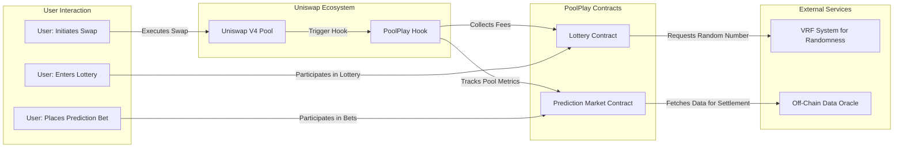

# PoolPlay

[](https://www.eigenlayer.xyz/)
[](https://docs.uniswap.org/)
[](https://book.getfoundry.sh/)
[](https://nextjs.org/)
[](https://tailwindcss.com/)
[](https://ui.shadcn.com/)
[](https://reown.dev/)
[](https://wagmi.sh/)
[](https://tanstack.com/query)

**PoolPlay** is a Uniswap V4 hook that transforms liquidity pool interactions by integrating gamification features. With Lottery Pools and Prediction Markets, PoolPlay incentivizes liquidity provision and trading by letting users earn rewards through randomized lotteries and strategic bets on pool metrics.

## Table of Contents

- [PoolPlay](#poolplay)
  - [Table of Contents](#table-of-contents)
  - [Features](#features)
  - [Architecture](#architecture)
  - [Getting Started](#getting-started)
    - [Prerequisites](#prerequisites)
    - [Installation](#installation)
  - [Contract Overview](#contract-overview)
  - [Usage](#usage)
  - [Contributing](#contributing)
  - [License](#license)
  - [Team Members](#team-members)

## Features

- **Lottery Pools:**  
  - A small extra fee is collected on each swap, accumulating into a lottery pot.
  - At regular intervals (e.g., weekly), a random liquidity provider wins the pot after deducting a 10% operator commission.
  
- **Prediction Markets:**  
  - Users place bets on future pool metrics (e.g., whether TVL will exceed a specified threshold).
  - The hook tracks relevant metrics and settles bets via a dedicated Prediction Market Contract, with a nominal fee per bet.

## Architecture

The diagram below shows the core components and data flow within PoolPlay:



*Note: The diagram illustrates a high-level overview of the system. Users interact with Uniswap pools, which trigger the PoolPlay Hook to route fees and data to the Lottery and Prediction Market contracts. External services like a VRF system and off-chain data oracle are integrated for randomness and reliable metric tracking.*

## Getting Started

### Prerequisites

- **Node.js & npm:** For development tools and scripts.
- **Foundry:** For smart contract development and testing.
- **Ethereum Wallet:** To interact with testnets/mainnet.
- **Solidity:** Familiarity with writing and deploying smart contracts.

### Installation

1. **Clone the repository:**

   ```bash
   git clone https://github.com/yourusername/PoolPlay.git
   cd PoolPlay
   ```

2. **Install dependencies:**

   ```bash
   npm install
   ```

3. **Configure environment variables:**  
   Create a `.env` file for storing sensitive information like private keys and API endpoints.

   ```bash
   cp .env.example .env
   ```

4. **Compile the contracts:**

   ```bash
   npx hardhat compile
   ```

5. **Deploy to a testnet:**

   ```bash
   npx hardhat run scripts/deploy.js --network <network-name>
   ```

## Contract Overview

- **PoolPlay Hook Contract:**  
  Implements the Uniswap V4 hook interface to intercept swap transactions, extract fees, and trigger gamified functionalities.

- **Lottery Contract:**  
  Accumulates swap fees to form a lottery pot and uses a verifiable randomness function (VRF) to select a random liquidity provider periodically.  
  - *Operator Commission:* 10% of the pot.

- **Prediction Market Contract:**  
  Tracks key pool metrics (e.g., TVL) to allow users to bet on future performance.  
  - *Settlement:* Based on data from off-chain oracles.

## Usage

- **As a Liquidity Provider:**  
  Provide liquidity to Uniswap pools integrated with PoolPlay and automatically be eligible for lottery rewards.

- **As a Trader/Speculator:**  
  Execute swaps to contribute fees and participate in prediction bets to potentially profit from pool performance insights.

- **For Developers:**  
  Leverage the hook interfaces to integrate further functionalities or build complementary dApps around PoolPlay.

## Contributing

We welcome contributions to enhance PoolPlay! Please check our [CONTRIBUTING.md](CONTRIBUTING.md) for guidelines.

## License

This project is licensed under the [MIT License](LICENSE).

## Team Members

- **Signor1**
- **JeffreyJoel**
- **BenFaruna**
- **PhantomOZ**
