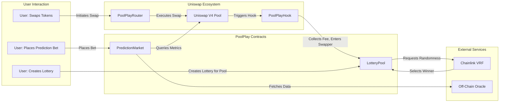

# PoolPlay

[](https://www.eigenlayer.xyz/)
[](https://docs.uniswap.org/)
[](https://book.getfoundry.sh/)
[](https://nextjs.org/)
[](https://tailwindcss.com/)
[](https://ui.shadcn.com/)
[](https://reown.dev/)
[](https://wagmi.sh/)
[](https://tanstack.com/query)

PoolPlay is a Uniswap V4 hook that gamifies decentralized finance by integrating lottery pools and prediction markets into liquidity pool interactions. Users can enter lotteries simply by swapping tokens through supported pools, with fees collected contributing to prize pots, while prediction markets allow betting on pool metrics like TVL.

## Table of Contents

- [PoolPlay](#poolplay)
  - [Table of Contents](#table-of-contents)
  - [Features](#features)
  - [Architecture](#architecture)
  - [Getting Started](#getting-started)
    - [Prerequisites](#prerequisites)
    - [Installation](#installation)
  - [Contract Overview](#contract-overview)
    - [`PoolPlayHook`](#poolplayhook)
    - [`LotteryPool`](#lotterypool)
    - [`PoolPlayRouter`](#poolplayrouter)
    - [`PredictionMarket`](#predictionmarket)
  - [Usage](#usage)
  - [Contributing](#contributing)
  - [License](#license)
  - [Team Members](#team-members)

## Features

**Swap-to-Enter Lottery Pools**  

- Every swap through a PoolPlay-integrated Uniswap V4 pool collects a small fee (e.g., 1% of input amount)
- Swappers are automatically entered into daily lotteries via Chainlink VRF
- 90% of pot goes to winner, 10% operator commission

**Prediction Markets**  

- Bet on future pool metrics (TVL, volume) using ERC20 tokens
- Outcomes settled via PoolManager data/oracles
- 0.5% platform fee on settlements

## Architecture



## Getting Started

### Prerequisites

- Node.js 18+ & npm 9+
- Foundry (forge 0.2.0+)
- Ethereum wallet (MetaMask recommended)
- Solidity fundamentals

### Installation

Clone repository:

```bash
git clone https://github.com/yourusername/PoolPlay.git
cd PoolPlay
```

Install dependencies:

```bash
npm install
forge install
```

Configure environment:

```bash
cp .env.example .env
# Edit .env with your credentials
```

Compile contracts:

```bash
forge build
```

Deploy to testnet:

```bash
forge script script/Deploy.s.sol --rpc-url $RPC_URL --private-key $PRIVATE_KEY --broadcast
```

## Contract Overview

### `PoolPlayHook`

- Uniswap V4 hook handling swap interception
- Collects fees and manages lottery entries

### `LotteryPool`

- Permissionless lottery creation/management
- Chainlink VRF integration for winner selection
- 10% operator commission structure

### `PoolPlayRouter`

- Swap router ensuring proper hook interaction
- Maintains swapper address tracking

### `PredictionMarket`

- ERC20-based betting system
- Oracle-powered metric verification
- 0.5% platform fee on settlements

## Usage

**As a Swapper**  

1. Connect wallet to PoolPlay dApp
2. Select supported Uniswap V4 pool
3. Perform swap to automatically enter lottery

**As a Lottery Creator**  

```solidity
// Create lottery for pool with 1% fee
LotteryPool.createLottery(
  poolAddress,
  feeToken,
  1 days,
  100 // 1% fee in basis points
);
```

**As a Bettor**  

1. Deposit ERC20 tokens to PredictionMarket
2. Place bet on desired pool metric
3. Settle bet after validation period

## Contributing

We welcome contributions! Please see our [Contribution Guidelines](CONTRIBUTING.md) for details.

## License

MIT License - See [LICENSE](LICENSE) for full text

## Team Members

- [Signor1](https://github.com/Signor1)
- [JeffreyJoel](https://github.com/JeffreyJoel)
- [BenFaruna](https://github.com/BenFaruna)
- [PhantomOZ](https://github.com/PhantomOZ)
