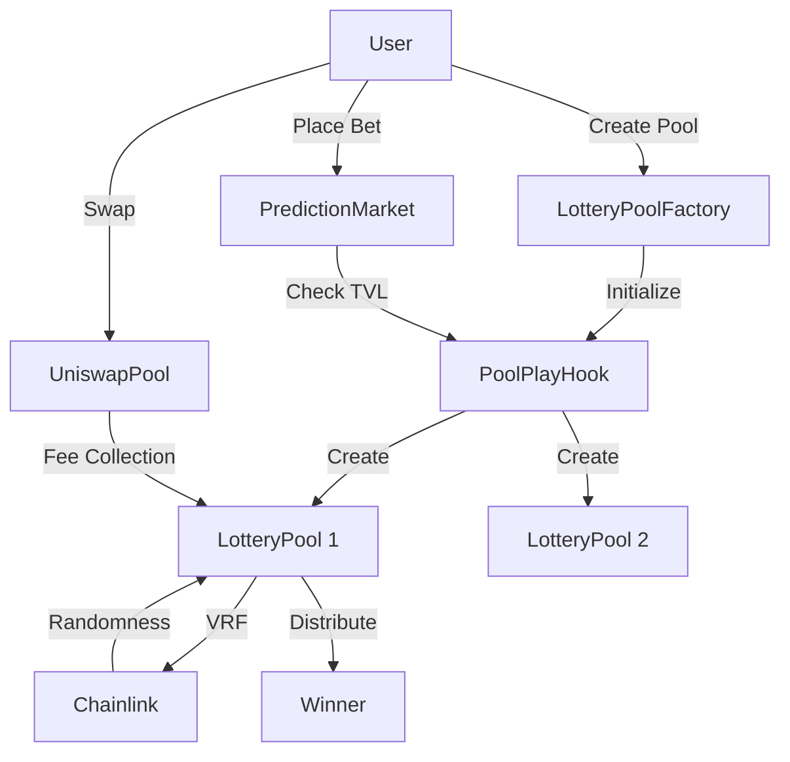

# My Flowchart

```mermaid
graph TD
    User -->|Create Pool| Factory[LotteryPoolFactory]
    Factory -->|Initialize| Hook[PoolPlayHook]
    Hook -->|Create| LotteryA[LotteryPool 1]
    Hook -->|Create| LotteryB[LotteryPool 2]
    User -->|Swap| UniswapPool
    UniswapPool -->|Fee Collection| LotteryA
    LotteryA -->|VRF| Chainlink
    Chainlink -->|Randomness| LotteryA
    LotteryA -->|Distribute| Winner
    User -->|Place Bet| PredictionMarket
    PredictionMarket -->|Check TVL| Hook
```
