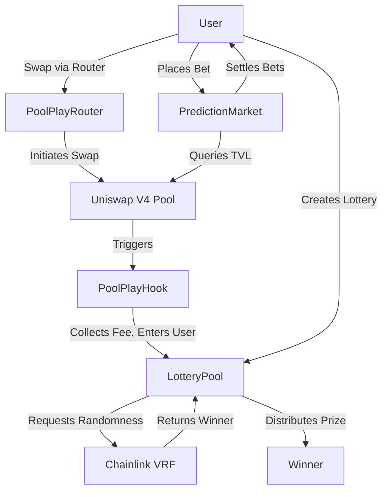

# My Flowchart

```mermaid
graph TD
    User -->|Swap via Router| Router[PoolPlayRouter]
    Router -->|Initiates Swap| UniswapPool[Uniswap V4 Pool]
    UniswapPool -->|Triggers| Hook[PoolPlayHook]
    Hook -->|Collects Fee, Enters User| Lottery[LotteryPool]
    User -->|Creates Lottery| Lottery
    Lottery -->|Requests Randomness| Chainlink[Chainlink VRF]
    Chainlink -->|Returns Winner| Lottery
    Lottery -->|Distributes Prize| Winner
    User -->|Places Bet| PredictionMarket[PredictionMarket]
    PredictionMarket -->|Queries TVL| UniswapPool
    PredictionMarket -->|Settles Bets| User
```
